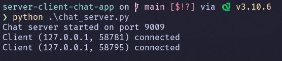
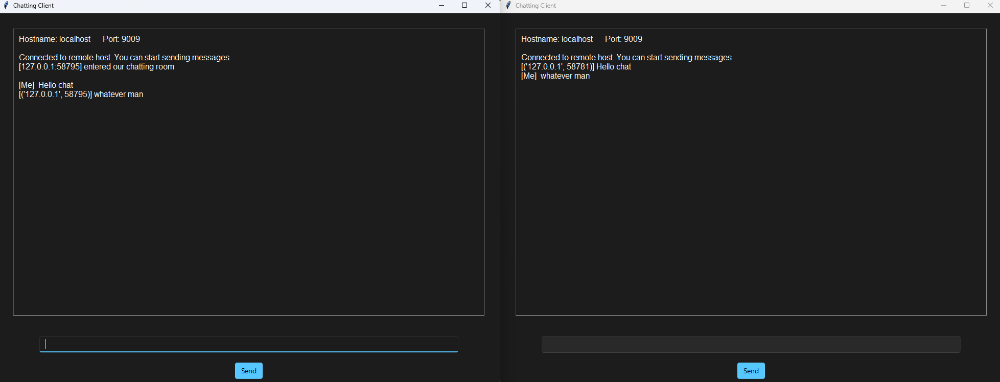

# server-client-chat-app
Tested on Windows 10/11, Arch Linux, and macOS 14 Sonoma

Ensure ``python`` is installed on your system:

```zsh
python --version
```


Install dependencies using pip:

```zsh
pip install -r requirements.txt
```

Run the server with:

```zsh
python .\chat_server.py
```

Run the client with:

```zsh
python .\GUI.py
```

Do this for as many clients as you're trying to connect to the server.

To use the client there is an input box at the bottom, write what you want to send to other users in that text box and click send when finished.

What you wrote will send to everybody's chat box and your text box will refresh itself waiting for further input.

If you want to disconnect from the server, click the X button on the client window and close it, the server will disconnect you when you leave.

## Screenshots

### Server


### Client


## Attribution

Followed [tutorial](https://www.bogotobogo.com/python/python_network_programming_tcp_server_client_chat_server_chat_client_select.php) by BogoToBogo for basis of the server code.
